# 🚀 [微调大型语言模型](https://www.deeplearning.ai/short-courses/finetuning-large-language-models/)

## 课程简介

1. 🔍 **为什么要微调**：通过微调，业务可以根据自己的具体需求调整模型，更新神经网络权重，并超越传统方法提升模型性能。

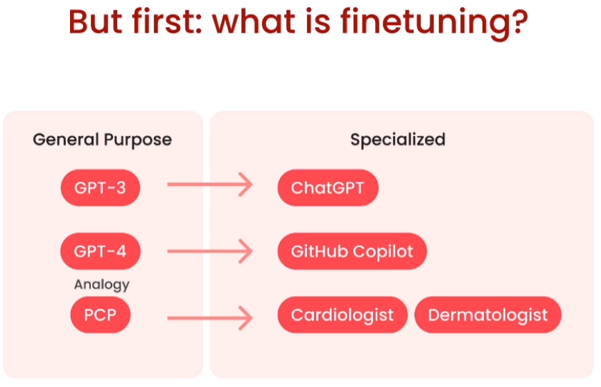 
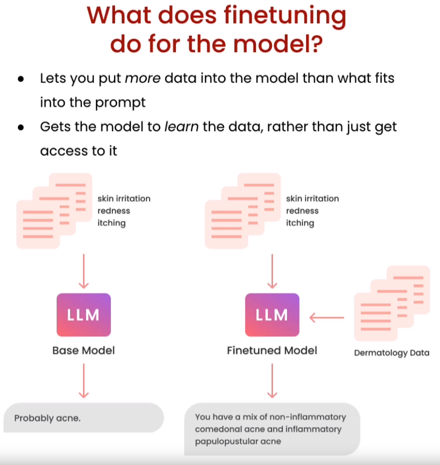 

2. 🏗️ **微调的应用场景**：了解何时以及为什么要对大型语言模型进行微调，以获得最佳效果。

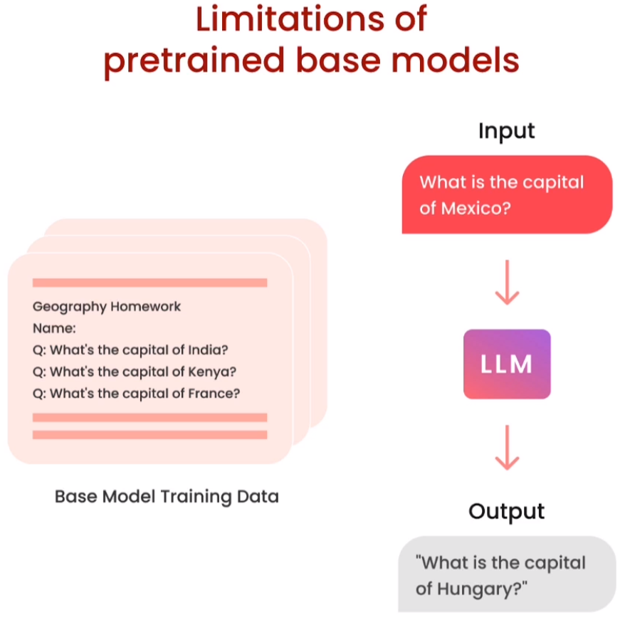 
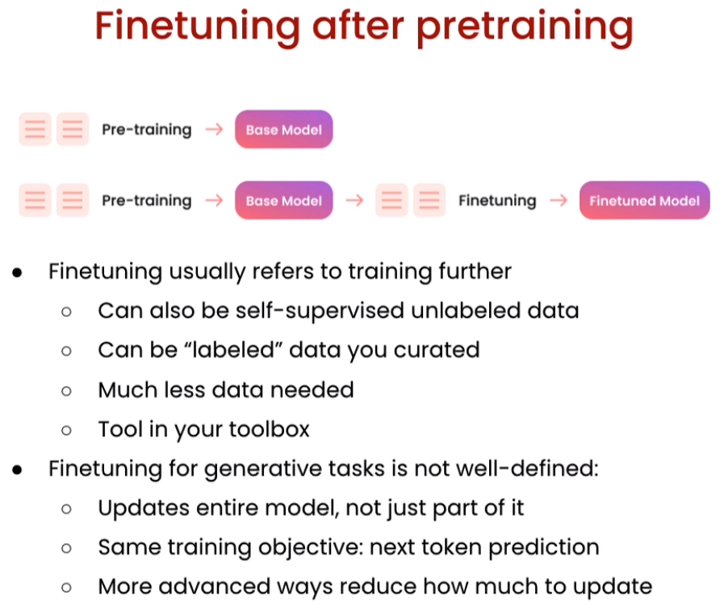 
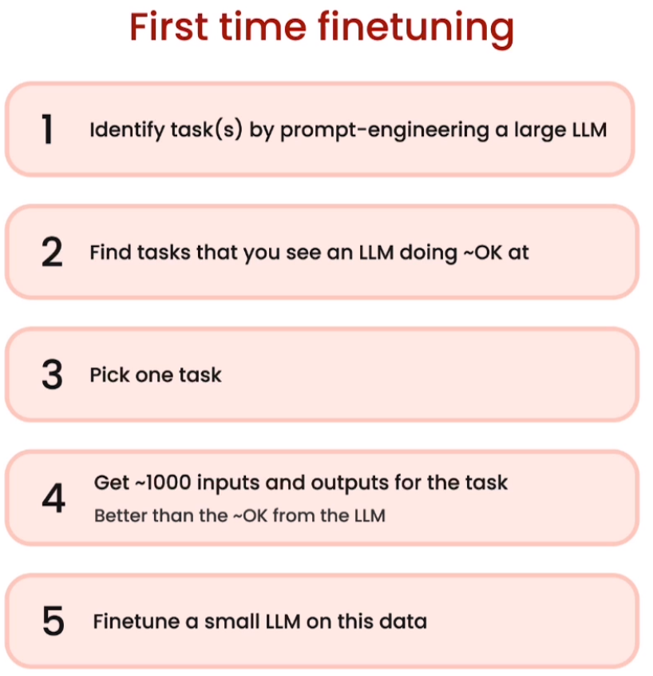 

3. 🧩 **指令微调**：探索优化模型指导特定任务的艺术，确保最有效地使用微调后的语言模型。

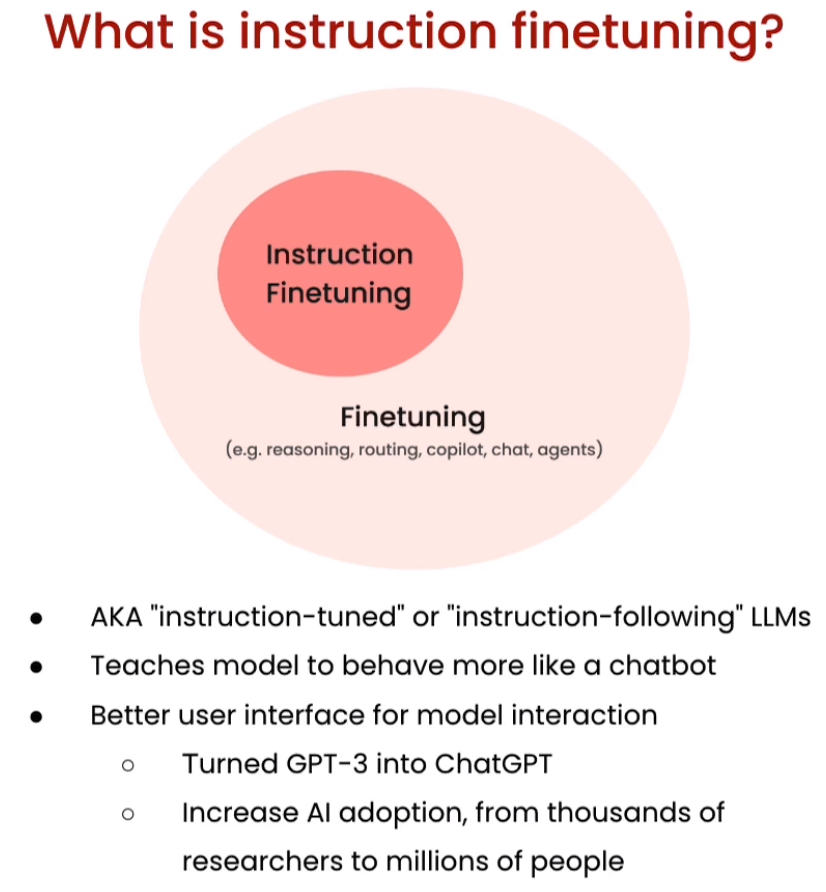 
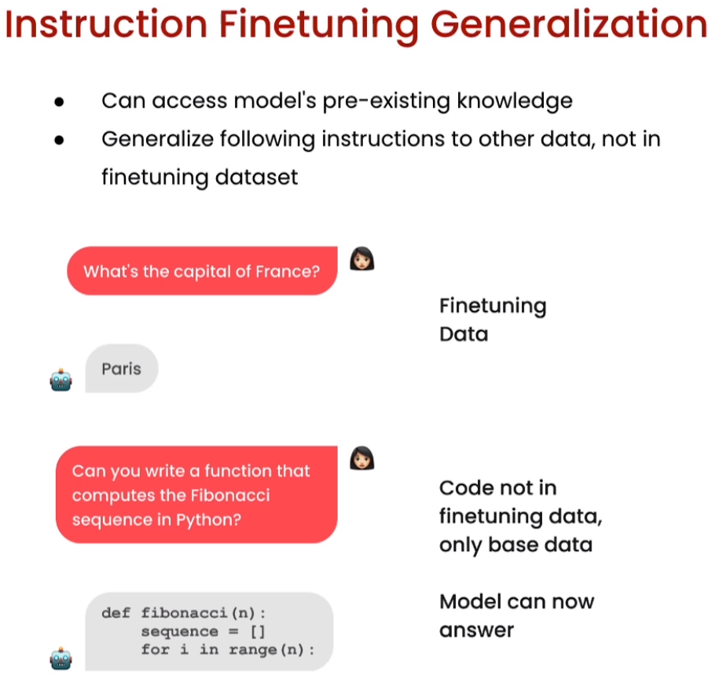 

4. 📦 **数据准备**：学习如何有效地准备数据，以充分利用微调过程。

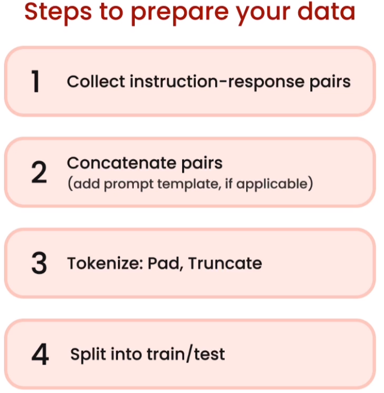 
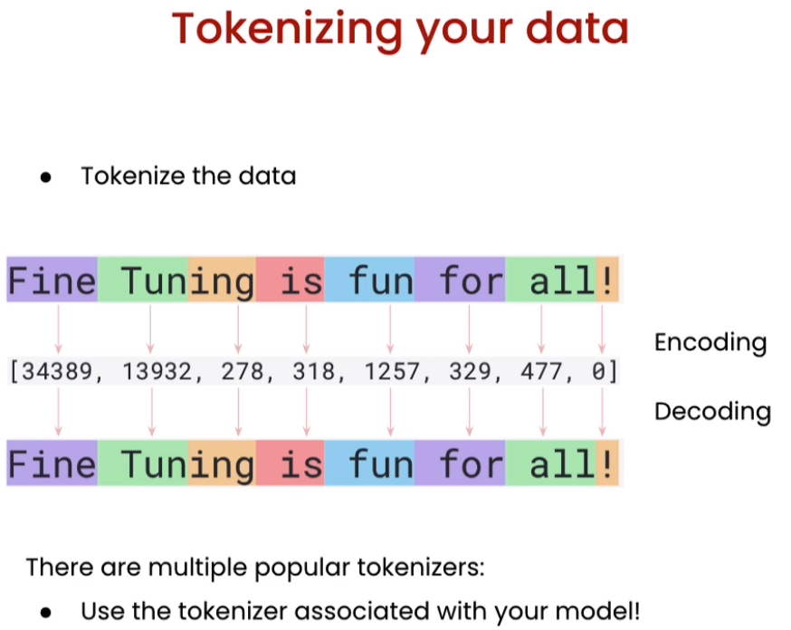 

5. 🧠 **训练和评估**：了解如何在私有数据上训练和评估大型语言模型，以实现效果提升。

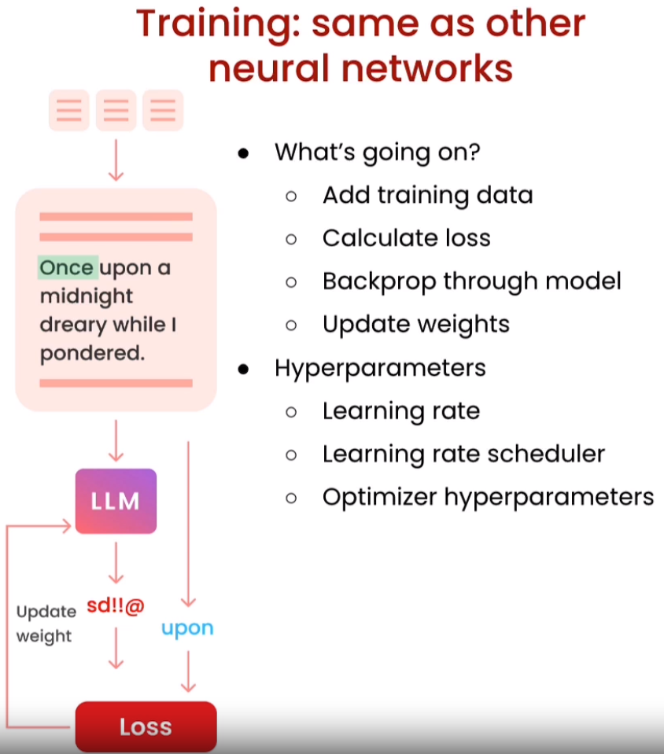 
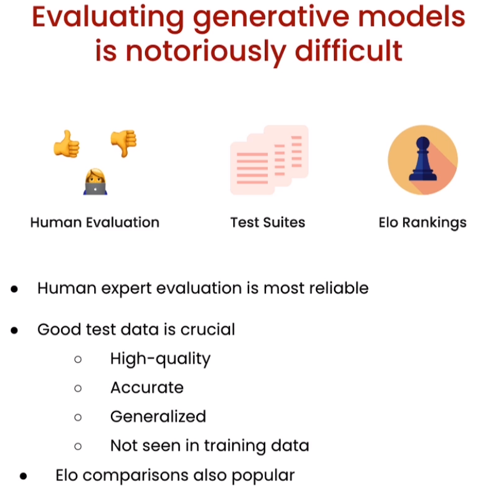 

## 关键要点
- 🧭 理解微调大型语言模型的战略性使用。
- 📊 掌握数据准备的艺术，以成功适应模型。
- 🚀 训练和评估大型语言模型，以取得令人印象深刻的结果。